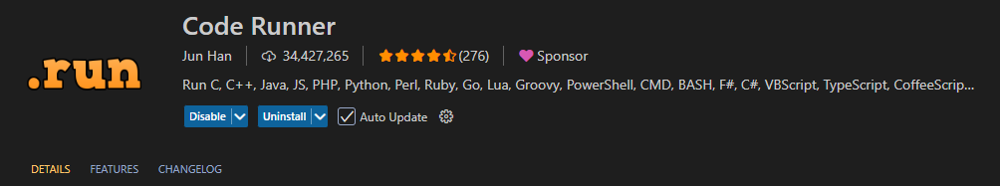
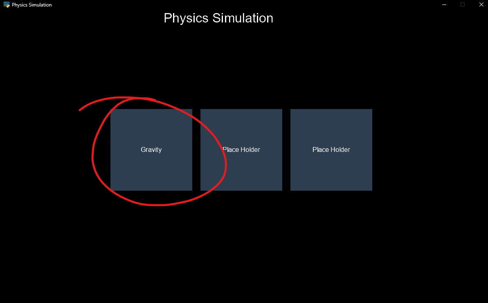
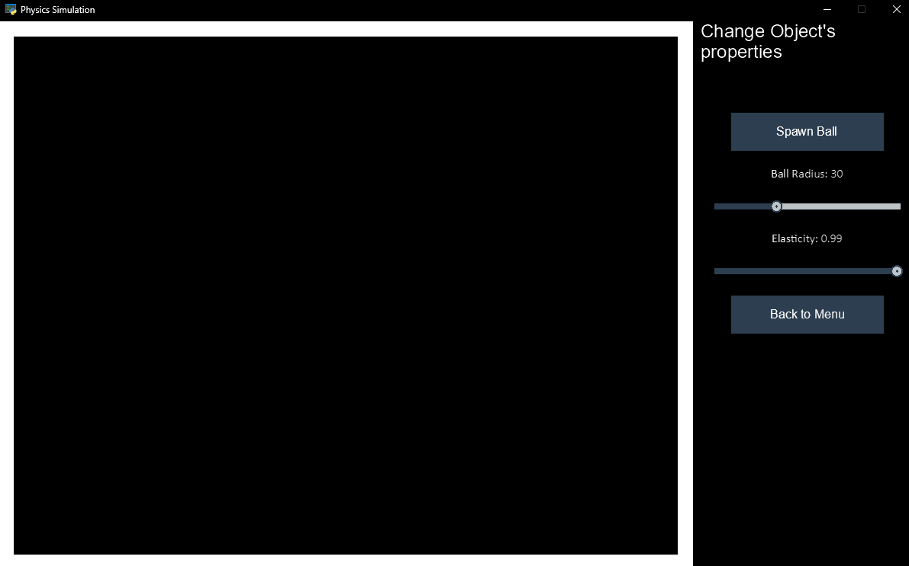

# Physics Simulator Prototype
This is my prototype program for my DTP301 project.

## Features
- Has a menu to navigate through different game environments.
- Only has 1 existing environment view being a Gravity Simulation.
- The environment contains a closed box to spawn ball objects which includes a sidebar to change the ball's properties such as Mass/Size and Elasticity (how bouncy the ball is).

## Installation
- Recommended to use python 3.12+
- Go to latest release and install the zip file.
- Extract the file in documents.

## How to run the program
### In VScode
First, run the following command to install required libraries: `pip install -r requirements.txt`
Run the code using the play button should be located on the top right corner of VSCode, if its not there then install CodeRunner in the VSCode extension marketplace.

### How to use
When you get the program to run successfully you will see the main menu (Not aesthetic and finished but its a prototype anyway).
There are 3 buttons but only Gravity is the only working one because I ran out of time in making the other Environments.

Click "Gravity"

Then it will switch the view to the Gravity Physics Simulation.

This is self-explanetory, as you can see on the right hand side you can change the ball's properties and spawn the Balls manually, or you can return back to the menu.
Now just watch the colorful balls bounce around!

Well that's about it for my project.

